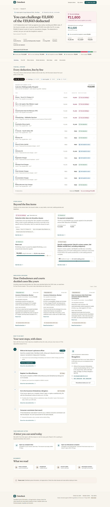
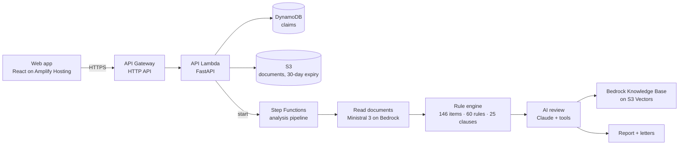

# ClaimBack

**Your insurer cut your hospital claim. Find out if they were allowed to.**

**Live: https://main.d2nbtgk28gfk1k.amplifyapp.com** - open any of the five sample claims; no sign-up.



Indian families routinely get health insurance claims cut ("non-payable consumables", "proportionate deduction", "reasonable and customary charges") or rejected ("non-disclosure"), and most people simply pay the difference. ClaimBack reads the policy schedule, hospital bill and insurer's letter. It checks every deduction against the policy wording, IRDAI's 2024 regulations and real Ombudsman decisions, shows exactly what can be challenged with the clause behind each point, and drafts the complaint letter.

## How it works



1. **Read.** A model on Amazon Bedrock reads the PDFs or phone photos into structured data (bill lines, deductions, dates, policy history). Today that is **Ministral 3 14B**, chosen by a setting; Claude and Nova work through the same code.
2. **Check.** A deterministic rule engine judges every deduction. There's no guessing: each verdict cites a verbatim policy clause, an IRDAI rule or a List I–IV item, with page numbers.
3. **Review.** The model judges only what the rules can't settle, given Knowledge Base passages and a list of allowed citations. It can only cite ids that exist in the curated data, and an unusable answer is discarded.
4. **Act.** The user gets a marked-up bill, similar real decisions (wins and losses), deadlines for the insurer → Bima Bharosa → Ombudsman route, and ready-to-send letters.

## Try it locally (no AWS needed)

The five sample claims run fully offline. The rule engine, reports, letters and progress all work; only reading your *own* uploaded documents needs Bedrock.

```bash
# backend (Python 3.13, uv)
cd backend
uv sync
uv run uvicorn claimback.api:app --port 8000

# frontend (Node 24), in another terminal
cd frontend
npm install
npm run dev          # http://localhost:5173, proxies /api to :8000
```

To read your own uploads locally (extraction, AI review, letter polishing), set `CLAIMBACK_LLM=bedrock` and
`CLAIMBACK_AWS_REGION=ap-south-1`, with AWS credentials that have Bedrock access.

### How accurate is the reading?

`backend/scripts/eval_extraction.py` scores a model against the five samples, whose correct answers are known.
Ministral 3 14B, measured on 19 Sep 2026:

| | Result |
|---|---|
| Scalar fields (dates, amounts, policy history) | 78 / 80 |
| Bill lines | 60 / 60 |
| Deduction rows | exact on all 5 |
| **Rule engine reached the same challengeable amount** | **5 / 5** |
| From the creased phone photo instead of the bill PDF | same result |

Cost is about **$0.02 per claim** against roughly $0.90 for Claude Opus 5. Swap models with `CLAIMBACK_MODEL_EXTRACT`,
`CLAIMBACK_MODEL_REVIEW` and `CLAIMBACK_MODEL_LETTER`, then re-run the eval to see what changes.

## Tests

```bash
cd backend
uv run pytest            # engine vs hand-checked ground truth for all 5 samples + API flow + privacy
```

Every quote in the datasets is verified against its source PDF with `python scripts/verify_quotes.py`.

## Deploy (Ship It)

Deployed to ap-south-1 (Mumbai), and every push to `main` redeploys it: GitHub Actions runs the tests, deploys the
SAM stack, ships the site to Amplify Hosting and smoke-tests the live API, authenticating to AWS with OIDC so no
keys are stored in GitHub. See [DEPLOY.md](DEPLOY.md).

## Repository

| Path | What |
|---|---|
| `backend/claimback/engine/` | Rule engine: non-payable item matcher, deduction and claim-level checks |
| `backend/claimback/llm/` | Claude on Bedrock: extraction, review agent, letter polishing |
| `backend/claimback/api.py`, `pipeline.py`, `handlers.py` | FastAPI app, step-by-step pipeline, Lambda entry points |
| `frontend/` | React + TypeScript + Tailwind web app |
| `infra/` | SAM template, Knowledge Base setup script |
| `data/`, `knowledge-base/`, `samples/` | Curated rules, policy clauses, real cases, and the 5 sample claims. See [DATASET.md](DATASET.md) |

## Built with

Built during WeMakeDevs "First Commit" (17-20 Sep 2026), on AWS.

**AI tools used**, as the hackathon rules require them to be declared:
- **Claude Code (Claude Opus 5)** wrote most of this repository - the dataset pipeline, rule engine, API, frontend and
  infrastructure - directed and reviewed by me throughout the event.
- **Claude Opus 5 on Amazon Bedrock** runs inside the product: it reads uploaded documents, reviews deductions the
  rules can't settle, and polishes letters.

**Third-party sources.** The datasets quote IRDAI circulars and regulations, two insurers' Arogya Sanjeevani policy
wordings, and Insurance Ombudsman and consumer court decisions. Those documents belong to their publishers and are
**not redistributed here**; `python scripts/download_sources.py` fetches each from its official URL, and
[DATASET.md](DATASET.md) lists every source. Full Ombudsman awards are left out of this repository because they
contain complainants' names.

ClaimBack gives information, not legal advice.
